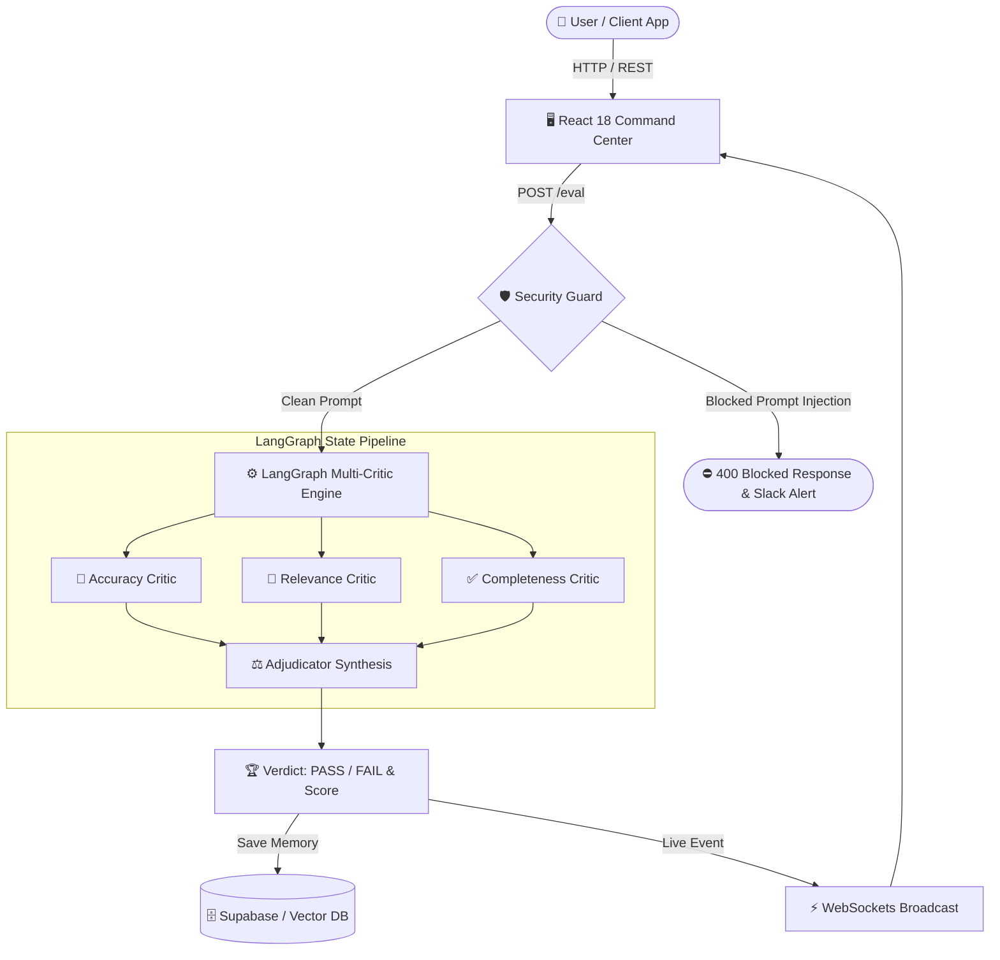

<div align="center">

# 🛡️ GUARDIAN
### **Enterprise AI Output Quality Command Center, Security Gateway & MLOps Audit Suite**

[](https://guardian-ecru.vercel.app/)
[](https://guardian-gvq5.onrender.com)
[](https://www.python.org/)
[](https://fastapi.tiangolo.com/)
[](https://react.dev/)
[](https://langchain-ai.github.io/langgraph/)

**[🌐 Experience Live Platform](https://guardian-ecru.vercel.app/)** • **[⚡ Backend API Docs](https://guardian-gvq5.onrender.com/docs)**

---

</div>

## 📌 Executive Summary

**GUARDIAN** is a production-grade, enterprise AI Output Evaluation, Security Gatekeeper, and MLOps Dataset Audit platform. Built to solve the unpredictability, hallucination, and security risks of Large Language Models (LLMs) in production, GUARDIAN routes, evaluates, sanitizes, and optimizes AI responses in real-time.

---

## ✨ Key Features & Capability Architecture

### 🛡️ 1. Multi-Critic LLM Evaluation Pipeline (`Tab 1`)
* **LangGraph State Machine Architecture:** Evaluates AI responses through parallel and sequential specialized critic nodes:
  * 🎯 **Accuracy Critic:** Verifies factual truth and technical precision (`0-5`).
  * 📍 **Relevance Critic:** Ensures direct adherence to user intent and constraints (`0-5`).
  * ✅ **Completeness Critic:** Detects missing details, steps, or code examples (`0-5`).
  * ⚖️ **Adjudicator Node:** Synthesizes scores into a weighted final score (`0-5.0`) and `PASS` / `FAIL` verdict.
* **1-Click Token & Prompt Engineering Optimizer:**
  * **`⚡ Optimize AI Response & Token Cost`:** Rewrites poor or wordy AI outputs to fix identified issues while optimizing for token conciseness (saving ~40-60% tokens).
  * **`✨ Optimize Question`:** Automatically rewrites vague user prompts into expert-level questions.
* **Recent Evaluation Audit History:** Persists evaluation runs with mini `ACC / REL / COM` visual metrics.

---

### ⚡ 2. Real-Time Proxy Gateway & Security Guard (`Tab 2`)
* **Pre-Check Security Guard:** Scans all incoming LLM requests before reaching third-party APIs:
  * Blocks **Prompt Injections**, system prompt overrides, and unauthorized data exfiltration attempts (`100% Token Savings`).
  * Filters **PII & Sensitive Tokens**.
* **1-in-5 Smart Sampling Token Optimizer:**
  * Evaluates 20% of traffic via round-robin sampling while passing remaining requests transparently, **saving ~80% in evaluation token costs**.
  * Overrides sampling to 100% evaluation for suspicious short responses (`<80 chars`) or baseline calls.
* **Live WebSocket Streaming:** Pushes real-time request logs (latency, verdict, score, token decision) directly to the command dashboard.
* **Slack Block-Kit Alerting:** Posts instant rich alert cards to team Slack channels when regression or safety breaches occur.

---

### 📊 3. Data Quality & MLOps Dataset Auditor (`Tab 3`)
* **Automated MLOps Model Benchmark Suite:** Automatically trains and benchmarks 4 algorithms on uploaded CSV datasets:
  * 🌲 **Random Forest Ensemble** (Non-linear decision tree ensemble)
  * 🛡️ **Extra Trees Ensemble** (Randomized feature bagging)
  * 🔹 **Logistic Regression** (Linear baseline classifier)
  * ⚡ **Naive Bayes** (Probabilistic classifier)
* **Underfitting vs. Overfitting Diagnostic Engine:**
  * Evaluates Train Accuracy vs Test Accuracy splits.
  * Triggers **`OVERFITTING ⚠️`** alert if variance gap > 10%.
  * Triggers **`UNDERFITTING ⚠️`** alert if capacity is insufficient.
  * Badges **`OPTIMAL FIT 🟢`** for high generalization models.
* **Automated Data Preprocessing:** Missing value imputation (Mean/Median/Mode), Label Encoding, One-Hot Encoding, and CSV export.

---

## 🛠️ Tech Stack

| Component | Technologies Used |
| :--- | :--- |
| **Frontend UI** | React 18, Vite, Vanilla CSS Design System, GSAP Animations, TanStack React Query |
| **Backend Core** | Python 3.11+, FastAPI, Uvicorn, Pydantic |
| **AI & Workflow Engine**| LangGraph, LangChain, OpenAI API (GPT-4o / GPT-4o-mini), Groq |
| **MLOps & Analytics** | Scikit-Learn (Random Forest, Extra Trees, Logistic Regression, Naive Bayes), TF-IDF, Pandas, NumPy |
| **Database & Memory** | Supabase (PostgreSQL vector memory), In-memory Ring Buffer |
| **Alerts & Streaming** | WebSockets (AsyncIO), Slack Block-Kit API |
| **Hosting & CI/CD** | Vercel (SPA Frontend), Render (Uvicorn Web Service), GitHub Actions |

---

## 📐 System Architecture



---

## 🚀 Local Development Setup

### 1. Prerequisites
* **Python 3.11+**
* **Node.js 18+** & **npm**

### 2. Backend Setup
```bash
# Clone repository
git clone https://github.com/Mayank-Chaudhary-011/GAURDIAN.git
cd GAURDIAN

# Create virtual environment
python -m venv guardian
source guardian/bin/activate  # On Windows: .\guardian\Scripts\activate

# Install dependencies
pip install -r requirements.txt

# Configure environment variables
cp .env.example .env
# Open .env and add your OPENAI_API_KEY, GROQ_API_KEY, etc.

# Start FastAPI backend server
uvicorn backend.api.main:app --reload --port 8000
```
*Backend will be running at `http://localhost:8000` (API Docs at `http://localhost:8000/docs`).*

### 3. Frontend Setup
```bash
cd frontend

# Install Node dependencies
npm install

# Start Vite development server
npm run dev
```
*Frontend will be running at `http://localhost:5173`.*

---

## 🔑 Environment Variables Reference

Copy `.env.example` to `.env` and configure:

| Key | Description | Required |
| :--- | :--- | :--- |
| `OPENAI_API_KEY` | OpenAI API key for evaluation and improver models | **Yes** |
| `GROQ_API_KEY` | Groq API key for low-latency fallback models | Optional |
| `SUPABASE_URL` | Supabase database URL for evaluation history persistence | Optional |
| `SUPABASE_KEY` | Supabase anon key | Optional |
| `SLACK_WEBHOOK_URL` | Incoming Slack Webhook URL for alert notifications | Optional |
| `ENVIRONMENT` | `development` or `production` | **Yes** |

---

## 🌐 Production Deployments

* **Live Frontend Web Application:** [https://guardian-ecru.vercel.app/](https://guardian-ecru.vercel.app/)
* **Live Production Backend API:** [https://guardian-gvq5.onrender.com](https://guardian-gvq5.onrender.com)

---

## 📄 License

Distributed under the **MIT License**. See `LICENSE` for details.

<div align="center">
  <sub>Built with ❤️ by Mayank Chaudhary</sub>
</div>
